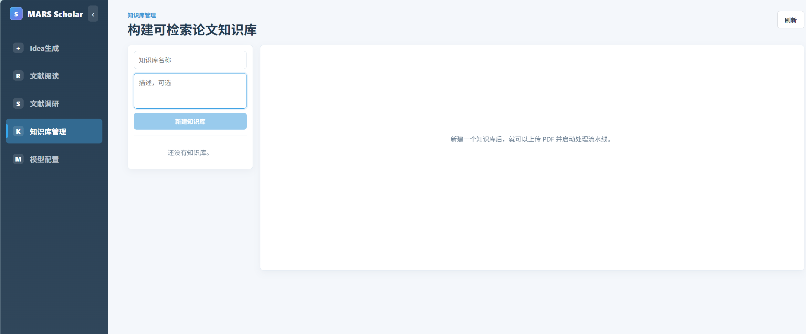
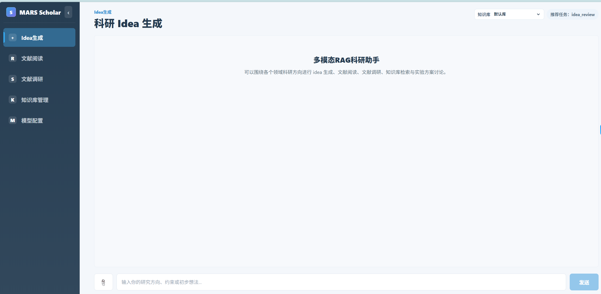
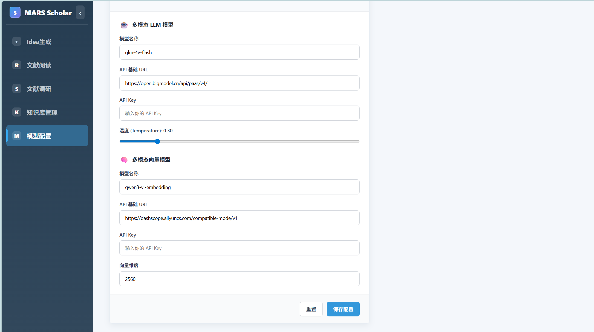

# MARS Scholar

MARS Scholar 是一个面向科研场景的多模态、多智能体 RAG 助手。MARS 代表 **Multimodal Agentic RAG for Science**：系统可以接收文字、图片和 PDF 文献，构建领域知识库，并通过多智能体协作完成文献问答、图表理解、文献总结、方法对比、调研规划和科研 idea 评审。

项目当前以推荐系统论文作为默认示例语料，但核心能力并不绑定推荐系统。只要换成医学、金融、教育、材料、法律、社会科学等领域的 PDF 数据，并重新 OCR 与入库，就可以构建对应领域的多模态科研助手。

## 核心能力

- 多模态输入输出：支持文字提问、图片上传、PDF 文献入库；回答中可以返回文本解释、检索证据、相关图片和表格。
- 领域知识库构建：创建知识库、上传 PDF、自动执行 OCR / 清洗 / 切块 / 向量化 / Milvus 入库。
- 文献阅读与问答：围绕选定知识库进行证据化回答，支持文本问题、截图问题和图表问题。
- 图表理解：从论文 OCR 结果中抽取图片、表格、caption 和上下文，支持多模态描述、检索和引用。
- 多智能体科研协作：通过规划、检索、阅读、分析、评审等角色协作完成复杂科研任务。
- 文献调研：按研究问题、方法、数据集、指标、结果和局限组织综述式回答。
- 论文与方法对比：从任务、模型、数据、指标、结论和适用场景对比相关工作。
- 科研 idea 评审：检索相似工作，分析创新空间、风险点、实验设计和下一步计划。
- 多工作区前端：提供 Idea 生成、文献阅读、文献调研、知识库管理、模型配置等工作区。
- 可配置模型服务：支持大模型、多模态模型、embedding 模型和 Milvus 连接参数配置。

## 工作流程

```text
上传领域 PDF
  -> DotsOCR 版面解析
  -> 文本清洗与图表抽取
  -> 文档切块与元数据整理
  -> 文本 / 多模态向量化
  -> 写入 Milvus 知识库
  -> 多智能体检索、阅读、分析与评审
  -> 输出文本回答、证据引用、相关图片/表格和科研建议
```

## 项目截图

README 中的图片不能放在代码块里，否则 GitHub 只会把它当作普通文本显示。

### 知识库管理



### 文献问答



### 模型配置



## 目录结构

```text
recommendate_project/
├── main.py                  # 命令行聊天入口
├── pyproject.toml           # Python 项目配置
├── requirements.txt         # pip 依赖清单
├── .env.example             # 环境变量模板，不提交真实 .env
├── docs/                    # 阶段文档、设计记录和 README 图片
├── src/                     # Python 源码
│   ├── api/                 # FastAPI 接口
│   ├── graph/               # LangGraph 对话与检索工作流
│   ├── research_agents/     # 多智能体科研分析流程
│   ├── dots_ocr/            # DotsOCR 调用封装
│   ├── post_ocr_pipeline/   # OCR 后处理、图片抽取、切块
│   ├── vector_ingest_pipeline/
│   ├── paper_profile_pipeline/
│   ├── profile_store_pipeline/
│   ├── idea_review_pipeline/
│   └── milvus_db/
├── test/                    # 离线评测脚本和样例
├── web/                     # Vite + React 前端
├── scripts/                 # 服务启动脚本
├── data/                    # 本地论文和生成产物，默认不提交
├── knowledge_bases/         # 用户上传知识库，默认不提交
└── output/                  # 日志和运行输出，默认不提交
```

## 快速开始

```bash
cd /home/lf/mount/LLM/project/recommendate_project
python -m venv .venv
source .venv/bin/activate
pip install -r requirements.txt
cp .env.example .env
```

填写 `.env` 后启动后端：

```bash
bash scripts/run_fastapi.sh
```

启动前端：

```bash
cd web
npm install
npm run dev
```

命令行聊天入口：

```bash
PYTHONPATH=src python main.py
```

## 构建知识库

1. 在前端进入“知识库管理”工作区。
2. 创建一个知识库，例如“医学影像综述”“大模型推荐系统”“金融风控论文”。
3. 上传该领域 PDF。
4. 点击“开始 OCR / 切块 / 入库”。
5. 回到文献阅读、文献调研或 Idea 生成工作区，选择该知识库后提问。

也可以使用命令行先检查 OCR 输入：

```bash
bash scripts/start_dotsocr_vllm.sh
PYTHONPATH=src python -m ocr_dots_vllm_batch --dry-run
```

## 数据目录

默认数据路径如下：

```text
data/papers/
data/processed_ocr/
data/processed_rag/
```

这些目录通常包含 PDF、OCR 结果、embedding cache 和中间 JSONL，体积较大，已在 `.gitignore` 中排除。项目仓库只提交代码、文档、配置模板和小样例，真实数据与密钥保留在本地。

## 技术栈

- Backend: FastAPI, LangGraph, LangChain, Pydantic
- Frontend: React, Vite, TypeScript
- OCR: DotsOCR + vLLM OpenAI-compatible server
- Vector DB: Milvus
- Retrieval: Dense embedding, multimodal embedding, BM25 sparse vector, hybrid retrieval
- Agent Workflow: intent routing, retrieval, answer evaluation, idea review, multi-agent research planning
- Evaluation: RAGAS-style response/context metrics and offline evaluation scripts
